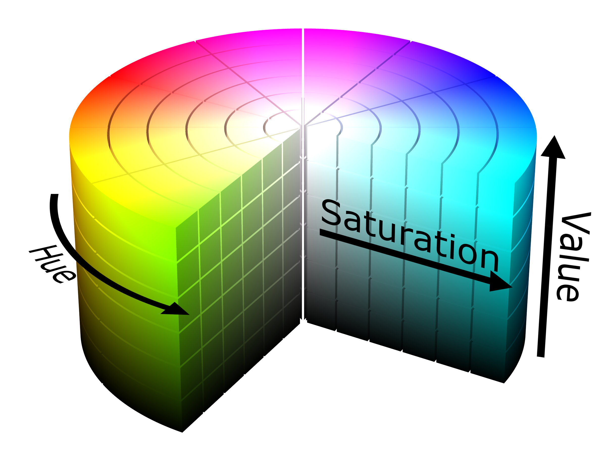
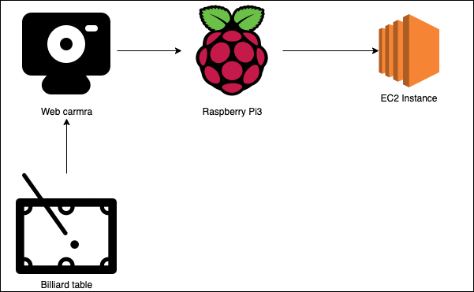
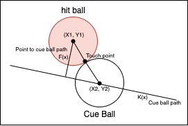

# eCV-Billiard-Solution

## Background Knowledge

### HSV



HSV, hue, saturation, value, are alternative representations of the RGB color model.

* Value of HSV
    * Hue(0~360 degree): 0 repsent red, 60 repsent yellow, 120 repsent green, 180 repsent cyan-blue, 240 repsent blue, and back to red
    * Saturation(0.0~1.0)
    * Value(0.0~1.0)

> In CV2 Hue is in 0 to 180, Saturation is in  0 to 255, and Value is in 0 to 255.

### Haar-like Feature Cascade

Object Detection using Haar feature-based cascade classifiers is an effective object detection method. It is a machine learning based approach where a cascade function is trained from a lot of positive and negative images. It is then used to detect objects in other images.

The algorithm needs a lot of positive images and negative images to train the classifier. Then we need to extract features from it. For this, Haar features shown in the below image are used. They are just like our convolutional kernel. Each feature is a single value obtained by subtracting sum of pixels under the white rectangle from sum of pixels under the black rectangle.


## Software & Device Requirements Specification

* Raspberry Pi 3

* Python 3.7

* OpenCV 3.4

## System Architecture



### Edge Computing

Using Raspberry Pi with web cam to capture the video, and using four points transfer to regular the frame.After finishing correction, using API to send the data to the cloud.

### Cloud Computing

After receiving the data, do data pre-processing to get the coordinate of the ball and the cue.

* Pre-processing
    * Transfer the format of the frame to HSV
    * Using HSV to threshold the frame
    * Using `cv2.findContours` to get the contours
    * After get the all of contours using the set value to filter the contours

* Predict the path
    * Fing the ball closest the cue
    * Calculate the path of ball, and predict the path after collide

## Path Algorithm

* Get the all ball and find the closest ball be the cue ball

    * `destance = sqrt((cue_ball_x - ball_x)^2 + (cue_ball_y - ball_y)^2)`

* Find the ball whose distance to predict path of the cue ball is smaller than two times radius of the ball

    * destance of point to line: `distance = abs(ax0+by0+c)/sqrt(a^2+b^2)`



* Find the position of cue ball. It will let the cue ball hit the ball which we found
    * `K(x) = ax/b + c`
    * `F(x) = (ay0 - bx0 + bx) / a`

* Use the touch point and the center of the ball which will be hit to find the path of hitten ball

* The path of the hit ball and the cue ball path after hit will perpendicular to each other

## Get Start

Please notice, all file need to run in the `ecv-billiard-solution`.

### Training Model

* Using `labelme` to select the object we want to train.

* Run the script which named [generate_pos_neg_image.py](./pre-processing/generate_pos_neg_image.py) to split the positive images and negative images. We will use these image to train the model.

* Run the script which named [pos_neg_list.py](./pre-processing/pos_neg_list.py) to generate the `pos.info` and `neg.info` for gererating the VEC file.

* Use `cd ./dataset` to change the directory.

* Run the following command to get the VEC file.

```bash
opencv_createsamples -vec ./pos.vec -info ./pos.info -bg ./neg.info -w 15 -h 15
```

* Run the following command to train model, and we can get the **XML** file.

```bash
opencv_traincascade -data ./xml -vec ./pos.vec -bg ./neg.info -numPos 39 -numNeg 96 -numStages 10 -minHitRate 0.995 -maxFalseAlarmRate 0.3 -w 15 -h 15 featureType HAAR
```

### Install the Packages

Run the following command to install the necessary packages.

```bash
pip3 install -r requirements.txt
```

### Edit the Parameter

Before you start to use this system, please edit some parameter in the [ballfinder](./ballfinder.py), [app](./app.py).

In the `class ball` you need to edit the filter value to fit the frame which we capture. And you also need to edit the HSV value in others color class to get the correct ball.

### Run

After that, you can run [raspberry_pi.py](raspberry_pi.py) on raspberry pi. And run [app.py](app.py) on the cloud or your computer.

## Reference

* [jabel3141/Hackathon](https://github.com/jabel3141/Hackathon)

* [OpenCV](https://docs.opencv.org/3.4/index.html)
